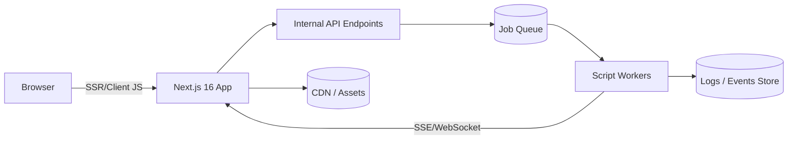
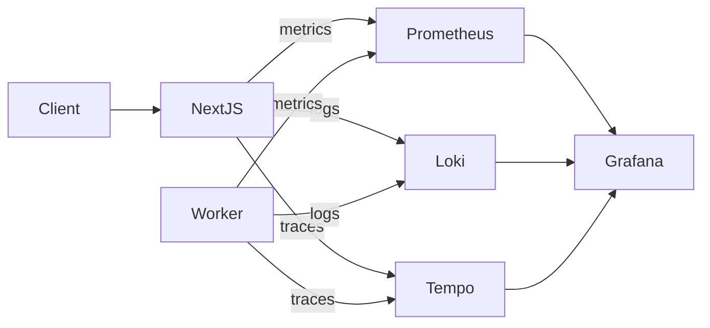

# Automation-Management — Technical Documentation ✅

**Last updated:** 2025-12-19

> Executive summary: Automation-Management is a Next.js 16-based web application that orchestrates, monitors, and manages automation tasks and scripts across environments. This document provides a comprehensive technical overview suitable for technical leadership, covering architecture, security, performance, testing, roadmap, and developer guidelines.

---

## Table of Contents

1. Project Overview
2. Architecture & Design
3. Security Considerations
4. Performance & Optimization
5. Testing Strategy
6. Future Enhancements & Roadmap
7. Developer Guidelines
8. Deployment & CI/CD
9. References
10. Appendix: Key Files & Folder Map

---

## 1. Project Overview 🔍

### Purpose

- Centralized UI and orchestration layer for managing automation scripts, monitoring executions, and visualizing logs and statuses.
- Reduce manual operational overhead by providing dashboards, localization, script management, and logs aggregation.

### Main Features

- Dashboard for real-time and historical automation jobs.
- Script management and execution lifecycle (start/stop/retry).
- Real-time status streaming and logs (SSE/WebSocket abstraction in `src/lib/status-stream.ts`).
- Localization support (i18n JSON files under `src/assets/i18n`).
- Role-based access control (RBAC) enforced server-side.
- Reusable component library and shared packages under `src/packages/`.

### Target Users & Business Goals

- SREs / Operators / Automation Engineers who manage batch jobs and scripts.
- Development teams who want to ship automation reliably.
- Business goals: reduce MTTR, increase automation coverage and operational transparency, and provide compliance-ready auditing and logs.

---

## 2. Architecture & Design 🏗️

### Overall System Architecture

- Client: Next.js 16 application using the `app/` directory features (Server and Client Components).
- API Layer: Next.js server routes (app router) and centralized `AxiosClint.js` for internal/external requests.
- Worker/Executor: Node-based script runner (scripts live in `src/scripts/`) launched by server or via job queue worker.
- Real-time: Status streaming via Server-Sent Events (SSE) or WebSocket (abstraction in `status-stream.ts`).
- Persistence: Logs and historical metadata are stored either in file-backed logs (`/automation-logs/`) or a structured store (ElasticSearch/Postgres) depending on deployment.

Mermaid diagram (conceptual):



### Next.js 16 Structure & Routing Strategy

- App directory routing: pages and layouts are defined under `src/app/`.
  - Example: `src/app/automation/dashboard/page.tsx` → `/automation/dashboard`.
- Use Server Components for data-intensive pages (dashboards) and Client Components (`"use client"`) for interactive UI.
- APIs: Implement server-side API endpoints with `route.ts` in the `app/api` folder for secure server-only logic.
- Code-splitting: Next.js automatically splits by route; use `dynamic()` for component-level lazy loading.

### Key Modules & Components

- `src/app/AxiosClint.js` — centralized Axios client for authenticated requests.
- `src/app/Provider.tsx` — app-level providers (auth, context, theming).
- `src/lib/*` — utilities that control script lifecycle and streaming (`start.ts`, `stop.ts`, `status.ts`, `status-stream.ts`).
- `src/scripts/` — runnable scripts and helper modules used by the executor.
- `src/automation/dashboard/` — dashboard pages & widgets.
- `src/packages/` — shared components, Redux utilities, constants.

### State Management Approach

- Local state: `useState`, `useReducer` for small components.
- Global state: app `Provider` or Redux/Redux Toolkit (the repo has `/src/packages/Redux` available).
- Remote server state: use `React Query` or `SWR` (recommended) for caching and background refresh.
- Real-time state: SSE/WebSocket clients update cached state (React Query mutation/update patterns).

### API Integration Details

- Centralize API calls in `AxiosClint.js` with typed interfaces where possible.
- Prefer server-side API requests for sensitive operations and use secure cookies (HttpOnly) or server-side token usage.
- Validate/parse server responses using Zod or TypeScript guards for safety.
- Error handling: consistent wrapper that returns typed error objects and supports retries for idempotent operations.

### Folder & Code Organization (high-level)

- `src/app` — Next.js app routes and layout
- `src/automation` — automation UI and subpages
- `src/lib` — script lifecycle utilities and streaming logic
- `src/scripts` — automation script files and utilities
- `src/assets/i18n` — localization files
- `src/packages` — shared components and utilities
- `automation-logs/` — persisted logs and artifacts

---

## 3. Security Considerations 🔐

### Authentication & Authorization

- Recommended approach: OpenID Connect (Auth0 / Azure AD / Okta) or JWT with short-lived access tokens + refresh tokens.
- Server-side enforcement: perform authorization checks on every API handler and server-rendered page.
- Token storage: use HttpOnly, Secure cookies for access tokens and refresh tokens to avoid XSS leakage.
- RBAC: implement roles (admin, operator, viewer) and resource-level authorization for critical actions (start/stop script).

### Data Protection

- TLS everywhere (HTTPS); enforce HSTS in production.
- Keep secrets out of repo — use environment variables or secret manager (Azure Key Vault, AWS Secrets Manager).
- Mask or redact PII in logs; never store plaintext credentials.
- At-rest encryption for DB and object stores; TLS for all inter-service communication.

### Prevention of Common Vulnerabilities

- XSS: sanitize/escape user-provided content, use DOMPurify for HTML sanitization, adopt strict Content Security Policy (CSP).
- CSRF: when using cookies, implement anti-CSRF tokens or use SameSite cookie policies.
- Injection: validate all inputs and use parameterized queries on the server.
- Secure headers: set `X-Frame-Options: DENY`, `X-Content-Type-Options: nosniff`, `Referrer-Policy`, and `Strict-Transport-Security`.
- Rate limiting and IP throttling for public-facing endpoints.

### Secure API Practices

- Enforce input validation (Zod/Joi) and strong typing of API contracts.
- Use principle of least privilege for service accounts and API tokens.
- Implement audit logs for sensitive operations (start/stop job, role changes).
- Regular dependency scanning and patching (Dependabot, Snyk, GitHub Security).

---

## 4. Performance & Optimization ⚡

### SSR / SSG Strategy

- Use SSR for pages requiring always-fresh data (dashboards with live job status).
- Use SSG/ISR for relatively static informational pages (docs, marketing) to reduce server load.
- Prefer server components to reduce client JS shipping.

### Lazy Loading & Code Splitting

- Use dynamic imports: `const Widget = dynamic(() => import('./Widget'))` for heavy components.
- Defer non-critical scripts and features behind user interactions.

### Caching Strategy

- CDN for static assets and images.
- HTTP caching: `Cache-Control` and `ETag` where applicable, use `stale-while-revalidate` strategy for dashboard caches.
- Server-side caching (Redis) to store hot job statuses and avoid frequent DB reads.

### Image & Asset Optimization

- Use Next.js `next/image` for responsive image delivery and built-in optimization.
- Compress assets and use WebP/AVIF where possible.
- Preload critical fonts and minimize font weight variants.

### Monitoring & Logging

- Use Sentry / Datadog for error and performance monitoring.
- Centralized logs (ELK/Opensearch, Datadog logs) with structured log formats.
- Implement correlation IDs for tracing script executions across services.

---

## 5. Testing Strategy ✅

### Unit, Integration & E2E

- Unit tests: Jest + React Testing Library for components and utilities.
- Integration tests: Test API handlers, script runner behavior using in-memory DB or test containers.
- E2E tests: Playwright (recommended) or Cypress for end-to-end flows (login, job lifecycle, RBAC checks).
- Mocking: MSW (Mock Service Worker) to simulate API responses in tests.

### Tooling & CI Practices

- Linters: ESLint with TypeScript rules and `eslint.config.mjs` included in the repo.
- Consistent scripts:
  - `npm run lint`
  - `npm run test` (unit)
  - `npm run test:e2e` (playwright/cypress)
- Run tests and static analysis in CI (GitHub Actions) with staged checks and preview deployments for E2E.

---

## 6. Future Enhancements & Roadmap 🚀

### Scalability Plans

- Migrate long-running script processing to a queue-based architecture (Redis + Bull / RabbitMQ) with workers.
- Use horizontally scalable stateless services behind a load balancer.
- Migrate logs to scalable analytics stores (Elasticsearch, ClickHouse, BigQuery).

### Feature Extensions

- Advanced scheduling UI with CRON-like features, retries, and dependency graphs.
- Webhooks / third-party integrations (Slack, PagerDuty, GitHub Actions).
- Multi-tenant support for large organizations.

### Performance Improvements

- Introduce request-level prioritization and backpressure for heavy dashboards.
- Move static assets to dedicated CDN and enable edge caching where applicable.

### Security Upgrades

- Automate secrets rotation and integrate HSM / secret manager.
- Periodic penetration testing and automated security regression tests.

### Automation (Script Creation)

- Provide a GUI and CLI templates for auto-generating new automation scripts.
- Implement sandboxed test-run and dry-run environments for scripts prior to production.

### LLM Integration (AI-assisted Development)

- Use LLMs to offer:
  - Smart code generation for script templates
  - Suggest fixes and improvements in PRs
  - Automatic documentation generation and changelog summarization
- Implement human-in-the-loop validation and content policies to ensure safety and correctness.

---

## 7. Developer Guidelines & Best Practices 🧭

### Coding Standards

- TypeScript strict mode enabled (`strict: true` recommended in `tsconfig.json`).
- ESLint + Prettier; follow the project's `eslint.config.mjs`.
- Prefer immutability and small, testable modules.
- Add types for API responses and use runtime validation (Zod) when possible.

### Onboarding & Contribution

- Branch naming: `feature/<short-desc>`, `fix/<short-desc>`.
- Use conventional commits for automation and clear changelogs.
- PR checklist: tests, lint/format, security review if auth-related changes.

### Code Review Focus

- Correctness and type safety
- Security validation (auth, input validation)
- Performance and bundle size impact
- Adequate tests and measurable coverage

---

## 8. Deployment & CI/CD 🔁

### Recommended Pipeline

- GitHub Actions pipeline (example stages):
  1. Install dependencies
  2. Lint + Type check
  3. Unit tests + coverage
  4. Build (`npm run build`)
  5. Run E2E tests against preview deploy
  6. Security scanning (Snyk / CodeQL)
  7. Deploy to staging/production (Vercel or container registry)

### Commands & Environment

- Dev: `npm install` then `npm run dev`
- Build: `npm run build`
- Start: `npm run start` (production if not using Vercel)
- Keep secrets in CI/CD environment variables or a secret manager.

---

## 9. References & Resources 🔗

- Next.js docs: https://nextjs.org/docs
- React: https://reactjs.org
- Axios: https://axios-http.com
- React Query: https://tanstack.com/query/latest
- SWR: https://swr.vercel.app
- Jest: https://jestjs.io
- Playwright: https://playwright.dev
- Zod: https://zod.dev
- OWASP Cheat Sheet: https://cheatsheetseries.owasp.org

---

## 10. Appendix — Key Files & Where to Look 🗂️

| Area               | Path / File                                  | Purpose                                 |
| ------------------ | -------------------------------------------- | --------------------------------------- |
| App entry & layout | `src/app/layout.tsx`, `src/app/page.tsx`     | Global layout and entry points          |
| API endpoints      | `src/app/api/*`                              | Server-only API handlers                |
| Axios client       | `src/app/AxiosClint.js`                      | Centralized client for APIs             |
| Auth               | `src/app/Provider.tsx`, `src/login/page.tsx` | Authentication and login UI             |
| Scripts            | `src/scripts/`                               | Automation script templates & utilities |
| Status streaming   | `src/lib/status-stream.ts`                   | SSE/WebSocket streaming logic           |
| i18n               | `src/assets/i18n/*.json`                     | Localization files                      |

---

## Quick Checklist — Suggested Immediate Actions ✅

1. Add an OpenAPI specification for API endpoints and generate typed clients.
2. Add React Query / SWR + Zod for typed server-state and validation.
3. Add GitHub Actions pipeline including unit/E2E/security scans.
4. Integrate Sentry/Datadog for observability and central logging.
5. Prototype queue-worker architecture for resilient script execution.

---

## 11. CI/CD Deep Dive 🔁

### Pipeline design principles

- Keep pipelines fast, deterministic, and incremental. Split pipelines into short validation steps (lint/typecheck), build/test, and deploy stages.
- Gate deployments with automated tests and manual approvals for production.
- Use preview environments for PRs (Vercel Preview / Kubernetes namespaces) to exercise E2E flows before promotion.
- Use artifact promotion: build once, sign the artifact, and deploy the same artifact across staging → canary → prod.

### Example GitHub Actions workflow (summary)

```yaml
name: CI
on: [push, pull_request]

jobs:
  validate:
    runs-on: ubuntu-latest
    steps:
      - uses: actions/checkout@v4
      - uses: pnpm/action-setup@v2
        with:
          version: 8
      - run: pnpm install --frozen-lockfile
      - run: pnpm lint
      - run: pnpm build --if-present
      - run: pnpm test:unit

  e2e:
    needs: validate
    runs-on: ubuntu-latest
    steps:
      - uses: actions/checkout@v4
      - run: pnpm install
      - name: Preview deploy
        # Push to a preview environment (Vercel or ephemeral k8s namespace)
        run: pnpm deploy:preview
      - name: Run E2E
        run: pnpm test:e2e -- --ci --reporter=dot

  release:
    if: github.ref == 'refs/heads/main' && github.event_name == 'push'
    needs: [validate, e2e]
    runs-on: ubuntu-latest
    steps:
      - uses: actions/checkout@v4
      - run: pnpm install
      - run: pnpm build
      - name: Build and push image
        uses: docker/build-push-action@v4
        with:
          push: true
          tags: user/automation-management:${{ github.sha }}
      - name: Deploy to staging
        run: ./scripts/deploy.sh staging ${{ github.sha }}
      - name: Manual approval
        uses: hmarr/auto-approve-action@v2
        # or use environments approvals in GitHub
      - name: Deploy to production
        run: ./scripts/deploy.sh production ${{ github.sha }}
```

> Tip: Use GitHub Environments for manual approvals and secrets with scoped access; prefer protected branch policies.

---

## 12. Observability & Tracing 📈

### Pillars: Logs, Metrics & Traces

- **Logs**: Structured JSON logs, emitted with a correlation_id and context (job_id, user, trace_id). Push to Loki/ELK/Datadog Logs.
- **Metrics**: Expose application-level metrics (http_request_duration_seconds, job_queue_depth, job_duration_seconds) in Prometheus format.
- **Traces**: Instrument request flows and script executions using OpenTelemetry and export to Tempo/Jaeger/Datadog.

Mermaid overview:



### Example: OpenTelemetry Node setup

```ts
// src/lib/telemetry.ts
import { NodeSDK } from '@opentelemetry/sdk-node';
import { getNodeAutoInstrumentations } from '@opentelemetry/auto-instrumentations-node';

const sdk = new NodeSDK({
  traceExporter: new OTLPTraceExporter({ endpoint: process.env.OTEL_COLLECTOR }),
  metricReader: /* ... */,
  instrumentations: [getNodeAutoInstrumentations()],
});

export function initTelemetry() {
  if (process.env.NODE_ENV === 'production') {
    sdk.start();
  }
}
```

### Log & Metric Best Practices

- Use structured logs (JSON) and include minimal context fields only. Avoid logging secrets.
- Use log levels (error/warn/info/debug) and sample debug logs in high-volume paths.
- Define and maintain an inventory of key metrics and SLIs (success rate, p95 latency, job failure rate).
- Implement dashboards for job throughput, failure rate, queue depth, and resource utilization. Set alerts on symptom + cause patterns (e.g., queue depth rising + worker CPU high).

---

## 13. Advanced Deployment Patterns 🚀

### Blue / Green & Canary

- **Blue/Green**: Deploy new release to separate environment, run smoke tests, and switch traffic via load balancer or service mesh.
- **Canary**: Gradually increase traffic to the new version—monitor metrics and rollback automatically on anomalies.
- Tools: **Argo Rollouts**, **Flagger**, or managed traffic split with Linkerd/Istio.

Example canary strategy (conceptual):

```mermaid
flowchart LR
  Git -> Build -> ImageRegistry
  ImageRegistry -> Canary(10%) -> Prod
  Canary -> Monitor(metrics)
  Monitor -> Promote -> Prod(100%)
```

### Feature Flags & Dark Launches

- Use flags for risky features; roll out by user cohort to validate behavior with real traffic.
- Integrate a flagging service (LaunchDarkly, Unleash) or use a self-hosted flags layer backed by Redis/DB.
- Beware: keep flag checks efficient and well-tested to avoid control-flow complexity.

### Infrastructure-as-Code & Immutable Infra

- Manage infra via Terraform/ARM/Bicep. Prefer immutable infra for reproducible rollbacks.
- Keep small stateful resources (databases) in separate modules and pin resource versions.

---

## 14. Scaling Strategies 🔼

### Horizontal vs Vertical Scaling

- Prefer horizontal scaling (add instances/workers) for stateless services.
- Right-size memory/CPU for workers based on p95 job memory and CPU consumption.

### Autoscaling Examples

- Kubernetes HPA based on CPU/memory and custom metrics (queue length via Prometheus Adapter).
- Consider KEDA for event-driven scaling (e.g., scale workers based on Redis/Broker queue length or Kafka lag).

Kubernetes HPA example:

```yaml
apiVersion: autoscaling/v2
kind: HorizontalPodAutoscaler
metadata:
  name: automation-api
spec:
  scaleTargetRef:
    apiVersion: apps/v1
    kind: Deployment
    name: automation-api
  minReplicas: 2
  maxReplicas: 20
  metrics:
    - type: Resource
      resource:
        name: cpu
        target:
          type: Utilization
          averageUtilization: 65
    - type: Pods
      pods:
        metric:
          name: queue_depth
        target:
          type: AverageValue
          averageValue: "100"
```

### Worker Pool Patterns

- Use job queues (BullMQ, RabbitMQ) with multiple worker pools for CPU vs IO-bound tasks.
- Implement backpressure: reject or delay incoming job submissions when queue depth exceeds threshold.

---

## 15. API Documentation & Contract Testing 📚

### OpenAPI & Typed Clients

- Maintain an OpenAPI (v3) definition for server routes. Keep it source-controlled in `openapi/automation.yaml`.
- Generate typed clients with `openapi-typescript` or `openapi-generator` and combine with Zod for runtime validation.

OpenAPI snippet (example):

```yaml
openapi: 3.0.3
info:
  title: Automation Management API
  version: 1.0.0
paths:
  /api/jobs:
    get:
      summary: List jobs
      responses:
        "200":
          description: OK
          content:
            application/json:
              schema:
                $ref: "#/components/schemas/Jobs"
components:
  schemas:
    Job:
      type: object
      properties:
        id:
          type: string
        name:
          type: string
        status:
          type: string
```

Generation example:

```bash
npx openapi-typescript openapi/automation.yaml --output src/lib/api-types.ts
```

### Contract Testing

- Use **Pact** or **Postman** contract tests to verify expectations between frontend and backend and to catch API drift.
- Incorporate provider verification against staging deployments in CI.

---

## 16. Developer Workflow & DX 🛠️

### Local Development

- Provide `Makefile` / `pnpm` scripts to spin up local stacks (Next app, Redis, Postgres) via `docker-compose`.
- Example `dev` script in `package.json`:

```json
"scripts": {
  "dev": "docker-compose -f docker-compose.dev.yml up --build",
  "dev:web": "next dev",
  "dev:worker": "node ./dist/worker.js"
}
```

### IDE & Tooling

- Recommended VS Code extensions: ESLint, Prettier, GitLens, Tailwind CSS IntelliSense (if used), Docker, Remote - Containers.
- Provide a `.devcontainer` for consistent developer envs with node, pnpm, and docker socket access.

### Quality of Life Improvements

- Husky + lint-staged for commit hooks (format, lint, run unit tests for touched files).
- PR templates and issue templates to standardize contributions.
- CLI (eg. `scripts/cli.ts`) to scaffold new automation scripts and tests.

---

## 17. Advanced Security Considerations 🔐

### Supply Chain & Image Security

- Adopt SBOM generation (CycloneDX) for builds and publish to artifact registry.
- Sign images with **cosign** and enforce image signature verification in runtime (e.g., admission controllers).
- Scan images on build via Trivy / Snyk and fail builds on critical findings.

### Secrets & Credential Management

- Use secret management (HashiCorp Vault, Azure Key Vault) and inject secrets at runtime. Avoid env files in repos.
- Use SOPS for encrypted config for IaC and GitOps flows.

### Runtime Policies & Network Controls

- Use **OPA/Gatekeeper** for policy-as-code (e.g., disallow privileged containers, enforce resource limits).
- Implement Kubernetes NetworkPolicies to restrict pod-to-pod communication.

### Incident Response & Auditing

- Maintain an incident response playbook; integrate alerting with escalation (PagerDuty / OpsGenie).
- Ensure audit logs for sensitive endpoints are immutable and retained per compliance needs.

---

## 18. Appendix — Example Files & Snippets 🗂️

### Dockerfile: Production-friendly example

```dockerfile
FROM node:20-alpine AS builder
WORKDIR /app
COPY package.json pnpm-lock.yaml ./
RUN npm i -g pnpm && pnpm install --frozen-lockfile
COPY . .
RUN pnpm build

FROM node:20-alpine
WORKDIR /app
ENV NODE_ENV=production
COPY --from=builder /app/.next .next
COPY --from=builder /app/node_modules ./node_modules
COPY --from=builder /app/public ./public
EXPOSE 3000
CMD [ "node", ".output/server/index.mjs" ]
```

### Kubernetes: Deployment snippet with probes

```yaml
apiVersion: apps/v1
kind: Deployment
metadata:
  name: automation-api
spec:
  replicas: 3
  template:
    spec:
      containers:
        - name: api
          image: user/automation-management:latest
          livenessProbe:
            httpGet:
              path: /healthz
              port: 3000
            initialDelaySeconds: 30
            periodSeconds: 10
          readinessProbe:
            httpGet:
              path: /ready
              port: 3000
            initialDelaySeconds: 10
            periodSeconds: 5
          resources:
            limits:
              cpu: "1"
              memory: "1Gi"
            requests:
              cpu: "250m"
              memory: "512Mi"
```

### Monitoring: Example Prometheus alert rule (high-level)

```yaml
groups:
  - name: automation.rules
    rules:
      - alert: JobQueueDepthHigh
        expr: avg_over_time(job_queue_depth[5m]) > 500
        for: 5m
        labels:
          severity: warning
        annotations:
          summary: "High job queue depth"
          description: "Queue depth average over 5m is > 500. Investigate worker health or throughput."
```